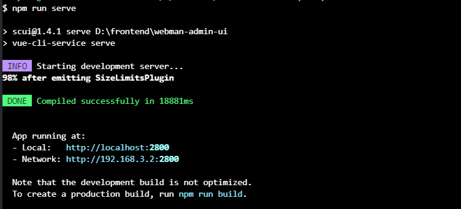
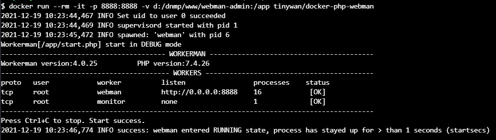

# webman-admin

[]()
[]()
[]()
[]()
[]()


基于 [webman](https://www.workerman.net/doc/webman/) + [vue3](https://v3.vuejs.org/) + [element-plus](https://element-plus.gitee.io/zh-CN/) 的前后端分离管理系统。

# [在线文档](https://github.tinywan.com/webman-admin-document/)

# 快速开始

## 后端安装

#### 克隆项目

> 克隆目录：`D:\dnmp\www`

```sh
git clone git@github.com:Tinywan/webman-admin.git
```

#### 安装依赖

```sh
cd /d/dnmp/www/webman-admin

composer install

php start.php start
```

启动完成后浏览器访问 `http://127.0.0.1:8888/`

## 前端安装

```sh
# 进入web目录
cd web

# 安装依赖
npm i

# 启动项目(开发模式)
npm run serve
```

**运行后如下所示**



启动完成后浏览器访问 http://127.0.0.1:2800

#### 使用 Docker 运行服务（可选）

```sh
docker run --rm -it -p 8888:8888 -v d:/dnmp/www/webman-admin:/app tinywan/docker-php-webman
```

以上表示挂载项目 `webman-admin`数据卷到容器`app`。同时映射宿主机和容器端口 `8888:8888` 

**运行后如下所示**


